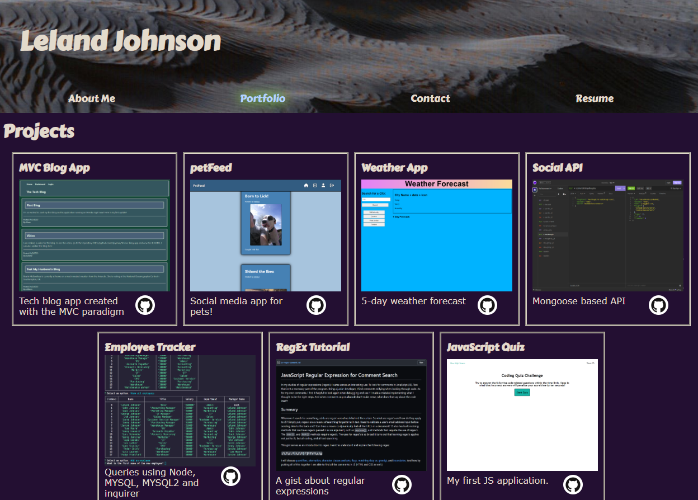

# React Portfolio

## Description

Visit the [site](https://eljayman.github.io/my-react-portfolio/) built with [React.js](https://reactjs.org/) and look at some of my best projects and the code.

## Table of Contents

- [React Portfolio](#react-portfolio)
  - [Description](#description)
  - [Table of Contents](#table-of-contents)
  - [Link to Video](#link-to-video)
  - [Questions](#questions)
  - [Credits](#credits)
  - [License](#license)

## Link to Video

[Video](https://watch.screencastify.com/v/2HQLVZ3OOnjy01EFb9Ay)

## Questions

If you have any questions about this application send me an email or message on github.

My email address is: [lelandoj@gmail.com](mailto:lelandoj@gmail.com)

My repo URL is: [https://github.com/eljayman/my-react-portfolio](https://github.com/eljayman/my-react-portfolio)

## Credits

This application was built in [node.js](https://nodejs.org/) with [React.js.](https://reactjs.org/) and uses [EmailJS](https://www.emailjs.com/) to send me your message.

## License

    Copyright 2022 eljayman

Permission is hereby granted, free of charge, to any person obtaining a copy of this software and associated documentation files (the "Software"), to deal in the Software without restriction, including without limitation the rights to use, copy, modify, merge, publish, distribute, sublicense, and/or sell copies of the Software, and to permit persons to whom the Software is furnished to do so, subject to the following conditions:

The above copyright notice and this permission notice shall be included in all copies or substantial portions of the Software.

THE SOFTWARE IS PROVIDED "AS IS", WITHOUT WARRANTY OF ANY KIND, EXPRESS OR IMPLIED, INCLUDING BUT NOT LIMITED TO THE WARRANTIES OF MERCHANTABILITY, FITNESS FOR A PARTICULAR PURPOSE AND NONINFRINGEMENT. IN NO EVENT SHALL THE AUTHORS OR COPYRIGHT HOLDERS BE LIABLE FOR ANY CLAIM, DAMAGES OR OTHER LIABILITY, WHETHER IN AN ACTION OF CONTRACT, TORT OR OTHERWISE, ARISING FROM, OUT OF OR IN CONNECTION WITH THE SOFTWARE OR THE USE OR OTHER DEALINGS IN THE SOFTWARE.
